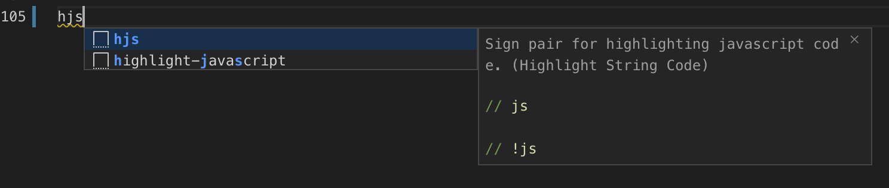

# Highlight String Code

Highlight string as SQL, HTML, CSS or JavaScript in most languages.

在代码中，高亮 SQL、HTML、CSS 或者 JavaScript 代码。

## Documents

[English](https://github.com/iuyoy/highlight-string-code/blob/master/README.md) | [中文文档](https://github.com/iuyoy/highlight-string-code/blob/master/docs/README_CN.md)

## Requirements

- Visual Studio Code v1.6.0 and above is recommended, but I'm not sure.

## Features

- Highlighting
- Commenting
- Bracket matching
- Closing pairs
- Snippets

## Usages

| Language | Sign pair                     | Snippets                      | Comment|
| -------- | ----------------------------- | ----------------------------- | -------|
| SQL      | `--sql`, `;`                  | -                             |
| SQL      | `--beginsql`, `--endsql`      | `hsql`, `highlight-sql`       |
| SQL      | `--begin-sql`, `--end-sql`    | -                             |
| SQL      | UPPERCASE KEYWORD, `;`        | -                             |
| Hive SQL | `--hive`, `--!hive`           | `hhsql`, `highlight-hive-sql` | [Hive SQL](https://marketplace.visualstudio.com/items?itemName=josephtbradley.hive-sql) is required
| HTML     | `<!--html-->`, `<!--!html-->` | `hhtml`, `highlight-html`     |
| CSS      | `/*css*/`, `/*!css*/`         | `hcss`, `highlight-css`       |
| JS       | `//js`, `//!js`               | `hjs`, `highlight-javascript` |
| Yaml     | `--- #yaml`, `#!yaml`         | `hyaml`, `highlight-yaml`     |

- SQL
  1. Insert sign pair `--sql` and `;` to highlight single SQL sequence. 
  
  2. Insert sign pair `--beginsql` or `--begin-sql` and `--endsql` or `--end-sql` to highlight one and more SQL suquences. 
  
  3. Any SQL sequence starts with **UPPERCASE** keyword (such as `SELECT`, `INSERT`, `UPDATE` and etc) and one of **WHITESPACE** character(such as `' ','\n','\t','\r','\f'`), and ends with `;` will be highlighted automatically. 
  
- HTML, CSS, JS
  - Insert sign pairs `<!--html-->` and `<!--!html-->`, `/*css*/` and `/*!css*/`, `//js` and `//!js` to highlight one and more HTML, CSS or JS suquences. Other comments can be added after *language name*. 
  
- Yaml
  - Insert sign pairs `--- #yaml` and `#!yaml` to highlight YAML suquences.
- Other
  - Highlight Variables between `{` and `}` in *highlighted* string code for `SQL` and `HTML` string. The idea is for `python` and `shell`, but works for any language now. 
  
- Snippets
  - Type `h{language_abbr}` or `highlight-{language_name}` to insert a highlight block sign pair. For example, type `hjs` or `highlight-javascript` to insert `// js` and `// !js`. 
  

## Installation

- Install from VS Code extensions (`ctrl + shift + x` or `cmd + shift + x` on mac).
- Install from [VSIX](https://github.com/iuyoy/highlight-string-code/releases) manually.

## Release Notes

### [v0.4.5]

- Modify js highlight pattern to fix [Issue#5](https://github.com/iuyoy/highlight-string-code/issues/5).

### [v0.4.4]

- Add "\s*" pattern before some signs to fix [Issue#1](https://github.com/iuyoy/highlight-string-code/issues/1).

### [v0.4.3]

- Add yaml support
- Fix typos.

Please see [CHANGELOG.md](./CHANGELOG.md) for more information.

## Issues

If you have any suggestion or issue, please feel free to submit it at [Github Issues](https://github.com/iuyoy/highlight-string-code/issues) page.
Any pull requests to add more features or improve the experience are also welcome.

## References

- Forked from [bashmish/es6-string-css](https://github.com/bashmish/es6-string-css) > [ptweir/python-string-sql](https://github.com/ptweir/python-string-sql)
- Visual Studio Code Extension API
  - [syntax-highlight-guide](https://code.visualstudio.com/api/language-extensions/syntax-highlight-guide)
  - [language identifiers](https://code.visualstudio.com/docs/languages/identifiers)
- TextMate Manual
  - [Language Grammars](https://macromates.com/manual/en/language_grammars)
  - [Scope Selectors](https://macromates.com/manual/en/scope_selectors)
- Issue [Highlighting of fenced code in markdown for known but non-default languages](https://github.com/microsoft/vscode/issues/71888)
  - [vscode-fenced-code-block-grammar-injection-example](https://github.com/mjbvz/vscode-fenced-code-block-grammar-injection-example)
  - [vscode-comment-tagged-templates](https://github.com/mjbvz/vscode-comment-tagged-templates)